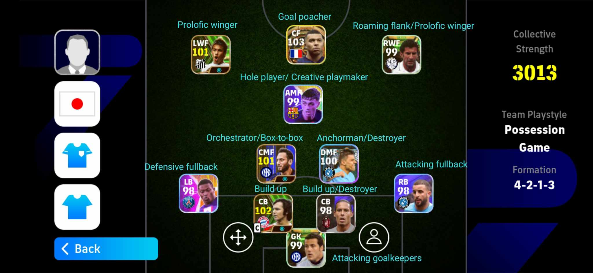

# YOU SHOULD KNOW THESE THINGS IN EFOOTBALL 

## TEAM PLAYSTYLE

|                 | Passing      | Off Ball Movement | Defensive Line | Pressing        |
|:---------:      |:-------:     |:-----------------:|:--------------:|:--------:       |
|Possesion        |Shortest      |Come short         |Highest         |Semi-aggressive  |
|Quick counter    |Mixed         |Most runs          |High            |Aggressive, high |
|Long ball counter|Direct        |Run from deep      |Deepest         |Sprint to regroup|
|Out wide         |Mix, use wings|Wide, overload box |Mid-block       |Regroup          |
|Long ball        |Direct        |Defence sits       |Deep            |Regroup          |

* **POSSESION**: aims to strangle the opponents by defending with the ball. A high line and high press is susceptible to through balls. It has the least runs forward as players come to the ball, so need to use LB+pass for a vertical 1-2, or RB+pass for a horizontal 1-2. I think Classic Number 10's do the best in this playstyle.
* **QUICK COUNTER**: has a high line too, and has the most aggressive team press. It feels fluid as players flood forward to make themselves available for a pass, but this then leaves you susceptible to the counter attack.
* **LONG BALL COUNTER**: is aimed at those who will have a low defensive line, so don't engage pressing until the opposition are in your half or you'll create a lot of space between FWDS and MIDS, and MIDS and DEF. You'll concede more deflections and give up possession and invite players onto you. When you gain the ball, you'll play direct to take advantage of your team bursting forward.
* **OUT WIDE**: is probably the most balanced of all playstyles defensively and offensively. In possession use the width of the touchline the players will hug. When you get into crossing positions, your MIDS and opposite winger will burst into the box to look to get onto crosses.
* **LONG BALL**: has your defence sit very deep with the aim of frustrating your opponent with men behind the ball and looking to play direct to 2-3 attackers and grab a goal. Fewer players support the attack than long ball counter.

### TIPS 
*  In general case
    * If the playstyle have high defensive line, you should use Offensive Goalkeepers (Neuer, Allisson,...) to sweep up the space in front of them rather than to use Defensive Goalkeepers. In 
        * **GK**: **Offensive goalkeepers** *(Neuer, Onana, Allisson, ...)*
    * For the centre back, usually a combine of a Build Up (Beckenbauer, Van Dijk, De Light,...) with an Destroyer (Thiago Silva, Koulibaly,...) or you can use double Build Up.
        * **CB**: **Build up** *(Beckenbauer, Van Dijk, De Light,...)*/ **Destroyer** *(Thiago Silva, Koulibaly,...)*
    * Combine 1 attacking right-back/left-back with 1 defensive left-back/right-back to have a back up person if you take a counter.
        * **RB/LB**: **Attacking full-back** *(Trent, Ben White,...)* / **Defensive full-back *(Wanbi Saka, Pavard,...)*
    * For the middlefiled, a cmf like Orchestrator or Creative playmaker (great ball control and good passing) combine with some Box-to-box or Hole Player for diverse attacking while dmf must have Anchorman or Destroyer for good defending and holding their position(If your CB have one Destroyer, you should use Anchorman).
        * **CMF**: **Orchestrator** *(Modric, Xhaka,...)* / **Creative plamaker** *(Pedri, De Bruyne,...)* / **Hole player** *(Bellingham, Fekir,...)* / **Box-to-Box** *(De Paul, Rice,...)* 
        * **DMF**: **Anchorman** *(Rodri, Casemiro,...)* / **Destroyer** *(Palhinha, Veira,...)*
    * In the front line, with wingers you can use both Prolific Winger and Roaming Flank, it depends on whether if you like speed or dribbling or passing. For striker, i recommend Goal Poacher combine with Hole Player if you use CF with SS or CF with wingers is fine.
        * **FW**: **Goal Pocher** *(Mbappe, Haaland)* / **Prolific Winger** *(Saka,Dembele)* / **Roaming Flank** *(Salah, Diaby)*

### PLAYER STYLE

|               PLAYING STYLE                |                     EXPLANATION                 |                COMPATIBLE POSITIONS                |
|:------------------------------------------:|:-----------------------------------------------:|:--------------------------------------------------:|
|Goal Poacher|A predatory striker who plays off the shoulders of the last defender.|CF|
|Dummy Runner|A player who attracts the defence to create space for other players to exploit.|CF/SS/AMF|
|Fox in the Box|A striker who lurks in the opposition 18 yard box just waiting for the ball.|CF|
|Target Man|A player that positions himself in the frontlines as a target man, and protects the ball with his physique.|CF|
|Deep-Lying Forward|A forward player that is willing to fall back to receive the ball and help create plays.|CF/SS|
|Creative Playmaker|A player who takes advantage of any opening in the defence to initiate attacks and assists in shots on the goal.|SS/RWF/LWF/AMF/RMF/LMF|
|Prolific Winger|A player who positions himself on the wing to receive passes, occasionally cutting into the center when the opportunity arises.|RWF/LWF|
|Roaming Flank|A player who tends to cut inside from the wing to receive passes.|RWF/LWF/RMF/LMF|
|Cross Specialist|A player who hugs the touchline, waiting for a chance to cross the ball in.|RWF/LWF/RMF/LMF|
|Classic No. 10|A playmaker who initiates attacks near the penalty area and will present himself to score when opportunities arise. When defending, he refrains from dashing to minimise stamina loss.|
|Hole Player|A player who looks to make runs into the opposition goal area when the team is on the attack.|SS/AMF/RMF/LMF/CMF|
|Box-to-Box|A player who tirelessly covers every blade of grass for the full 90 minutes.|RMF/LMF/CMF/DMF|
|Anchor Man|A deep sitting defensive midfielder protecting the backline.|DMF|
|The Destroyer|A tenacious battler who keeps opposition attacks at bay through hard tackling and pressing.|CMF/DMF/CB|
|Orchestrator|A player who lurks in deeper positions, ready to initiate attacks.|Compatible Positions: CMF/DMF|
|Build Up|A player who likes to drop back to receive the ball and trigger attacks from deep.|CB|
|Extra Frontman|A defender who likes to join in the attack and lay siege on the opposition goal at every given opportunity.|CB|
|Attacking Full-back|An attacking-minded full back who will run upfield and join the attack when presented with a chance.|RB/LB|
|Defensive Full-back|A solid full back who prefers to stay back and stick to defensive duties.|RB/LB|
|Full-back Finisher|An attacking full-back who enjoys joining the attack in high central areas|RB/LB|
|Attacking Goalkeeper|A keeper playing a sweeper type role who often comes out to cover the area behind the defence.|GK|
|Defensive Goalkeeper|A solid keeper who prefers to stay around the goal line.|GK|

* Some note about player style:
- In my experience, the hardest style to play is **Target man** and usually i see no one play this style :))). I think the most reasons that people hate this style becasue it's really hard to protect the ball, and most users tend to play one touch more often than shielding and dribbling.
- And here are some style you should'nt try if you still not familiar to the gameplay: **Deep-lying forward**, **Classic No 10**, **Extra Frontman**, **Dummy Runner**, **Fox in the Box**.
- Combo you can try :))):
    * Double Buid Up (Solid defend)
    * Box-to-box and Hole player (Easy to play)
    * Cross Specialist/Prolific winger with **Pinpoint Crossing** and a Goal Poacher with **Header** and **Aerial superiority**

I will update more when im free and there a lot more to write and copy :))))

